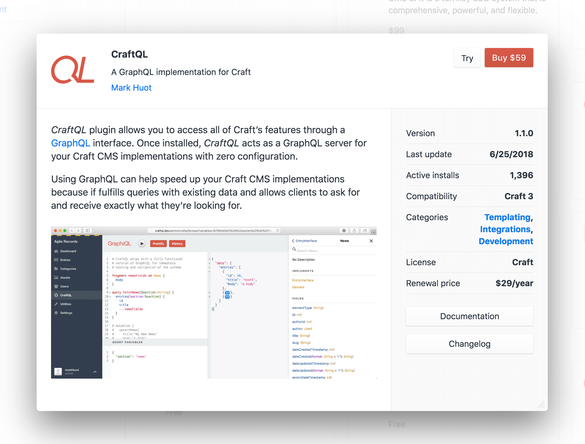

# プラグインストア

Craft のコントロールパネルは、Craft の機能セットを拡張するための数百のプラグインが利用できるプラグインストアを特徴とします。

::: tip
プラグイン開発のためのドキュメントをお探しの場合は、[Craft の拡張](extend/README.md)セクションをチェックしてください。
:::

プラグインストアにアクセスするためには、Craft のコントロールパネルのナビゲーションにある「プラグインストア」をクリックします。そこから、さまざまなプラグインカテゴリや選別されたリストをブラウズして、新しいプラグインを発見することができます。

プラグインをクリックすると、長い説明文やスクリーンショットを含むプラグインに関する詳細をモーダルウィンドウで開きます。

無料プラグインは、「インストール」ボタンをクリックしてインストールできます。

Craft が開発ドメイン上で実行されている場合、「試用」ボタンをクリックして商用プラグインを試用版としてインストールできます。

## 商用プラグイン

商用プラグインは Craft のライセンスモデルに従わなければなりません。

- 開発環境で自由に試すことができますが、本番環境での利用には支払いを必要とします。
- 商用ライセンスは Craft へのインストールごとに1回限り支払う料金で、購入後1年間はアップデートにアクセスできます。
- 追加のアップデートは、年ごとのアップデート料金で入手することができます。

商用プラグインを試して購入する準備ができている場合は、 プラグインストアに戻り、ヘッダーにあるカートアイコンをクリックしてください。カートモーダルの「有効なトライアル」セクションに、プラグインの一覧を確認できます。「カートに追加」ボタンをクリックして、カートにプラグインを追加し、チェックアウトを続行します。

チェックアウトのプロセスが完了すると、インストールしたプラグインは自動的にライセンスを取得します。[Craft ID](https://id.craftcms.com/) アカウントから、すべてのプラグインライセンスを管理することができます。

