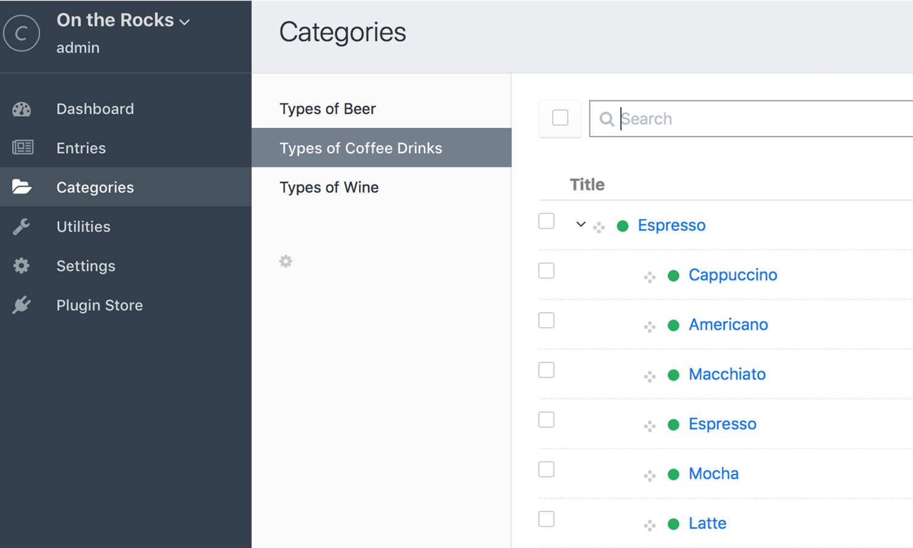
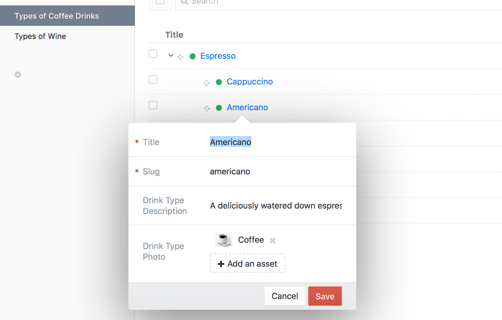

カテゴリ
==========

カテゴリを利用して、[エントリ](sections-and-entries.md)、[ユーザー](users.md)、および[アセット](assets.md)の分類を作成できます。

## カテゴリグループ

カテゴリを作成する前に、それらを含めるためのカテゴリグループを作成しなければなりません。それぞれのカテゴリグループには、次のことを定義できます。

* カテゴリグループの名前
* カテゴリグループのハンドル（テンプレートから、そのカテゴリグループを参照する方法）
* そのグループの中にネストできるカテゴリの最大レベル
* カテゴリ URI 形式
* カテゴリ URL にアクセスされたとき、どのテンプレートを読み込むか
* グループ内のカテゴリがどんな[フィールド](fields.md)を持つべきか

新しいカテゴリグループを作るには、「設定 > カテゴリ」に移動し、「新しいカテゴリーグループ」ボタンをクリックします。

少なくとも1つのカテゴリグループを作成すると、そのグループのカテゴリを作成できるようになります。

## カテゴリフィールドレイアウト

それぞれのカテゴリグループは、グループ内のカテゴリに関連付けられたデータをカスタマイズできる独自のフィールドレイアウトを持っています。デフォルトでは、すべてのカテゴリはタイトルフィールド（カテゴリ名）を持っています。

Craft 内で利用可能なすべてのフィールドタイプを使って、フィールドを追加することもできます。まだフィールドが存在しなければ、先に「設定 > フィールド」から作成しなければなりません。新しいフィールドは、カテゴリグループのフィールドレイアウトに割り当てられるようになります。

## カテゴリの作成と編集

少なくとも1つのカテゴリグループがあれば、コントロールパネルのメインナビゲーションに「カテゴリ」タブが表示されます。クリックすると、カテゴリのインデックスに移動します。サイドバーからカテゴリグループを選択すると、そのグループに含まれるカテゴリを追加・並び替え・削除できます。

カテゴリをダブルクリックすると、カテゴリの名前やスラグ、およびグループに関連づけられたすべてのフィールドを編集できるモーダルウィンドウが開きます。

カテゴリを作成するときのオプションは、次の通りです。

* カテゴリフィールドへの記入（フィールドを定義していなければ、タイトルフィールドだけが利用可能となります）
* スラグの編集（タイトルに基づいて、自動的に入力されます）
* 親カテゴリの選択。新しいカテゴリは、親カテゴリと階層的な関係を持ちます。これは複数レベルで分類を作成する際に役立ちます。親を割り当てる際に新しいカテゴリを作成するオプションもあります。

> 【ヒント】カテゴリグループの設定にある最大レベル欄で指定したレベルまでしか、カテゴリをネストできません。レベルを指定していない場合は、無制限にネストできます。

## カテゴリの割り当て

項目（エントリ、アセット、ユーザーなど）にカテゴリを割り当てるには、先に[カテゴリフィールド](categories-fields.md)を作成しなければなりません。

それぞれのカテゴリフィールドは、1つのカテゴリグループに接続されています。そのフィールドが付加されたものは何でも、グループに含まれるすべてのカテゴリとの[リレーション](relations.md)を持つことができます。

