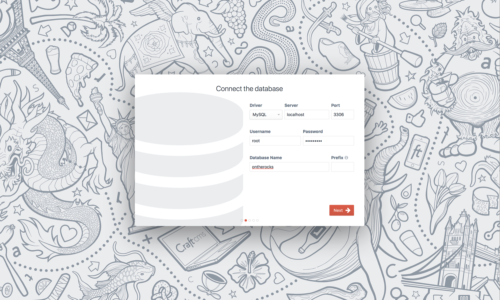
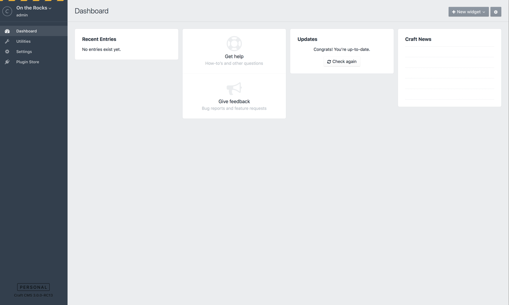
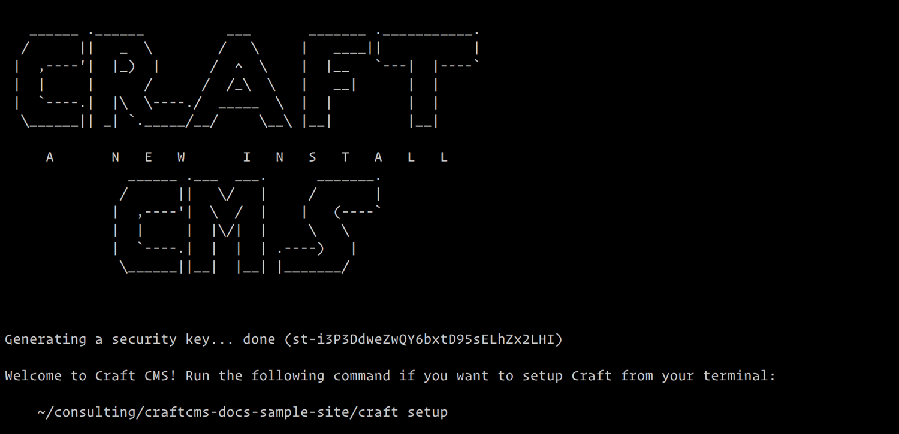

# インストールガイド

- [0. はじめに](#0-introduction)
- [1. Composer のインストール](#1-install-composer)
- [2. 新しい Craft プロジェクトの作成](#2-create-a-new-craft-project)
- [3. データベースのセットアップ](#3-set-up-the-database)
- [4. ウェブサーバーのセットアップ](#4-set-up-the-web-server)
- [5. インストーラの実行](#-5-run-the-installer)

## 0. 序論

Craft 3 は [Composer] パッケージとして利用できます。Composer に不慣れであれば、PHP ライブライのインストールやアップデートをターミナルコマンドによって容易にすることを目指す（npm のような）パッケージマネージャーと考えてください。

> ヒント：ZIP ファイルのダウンロードを望むなら、[craftcms.com](https://craftcms.com) のヘッダーにあるダウンロードボタンから Craft 3 をダウンロードできます。そのルートを選ぶ場合、ステップ3までスキップできます。

Craft の Composer サポートは2つのパートでできています。

1. **[`craftcms/cms`]** – Craft のすべてのソースコードを含む Composer パッケージです。
2. **[`craftcms/craft`]** – 新しい Craft プロジェクトのスタート地点として使うことができる Composer 「プロジェクト」です。

## 1. Composer のインストール

Composer 1.3.0 以降を稼働させるべきです。起動しているターミナル上で次のコマンドを実行することによって、（もし存在するのであれば）インストール済みの Composer のバージョンを確認できます。

    composer -V

`composer` が見つからない、あるいは、識別されないというエラーが出力されるなら、Composer がインストールされていません。次の Composer のガイドに従いインストールしてください。

- [macOS/Linux/Unix instructions] *（グローバルへのインストール）*
- [Windows instructions]

出力されたバージョンナンバーが `1.3.0` 以下なら、次のコマンドを実行してアップデートしてください。

    composer self-update

## 2. 新しい Craft プロジェクトの作成

新しい Craft プロジェクトを作成するため、次のコマンドを実行してください。（Composer が作成するプロジェクトのパスの代わりに`<PATH>` と記載しています。）

    composer create-project craftcms/craft <PATH>

メモ：システムに PHP 7 がインストールされていないと Composer が不満を言うかもしれません。しかし、別途インストールされた PHP（例えば MAMP や Vagrant）上で Craft を実行するつもりで、問題ないと判っているのであれば `--ignore-platform-reqs` フラグを使ってください。

Composer はすべてをインストールするのに数分かかるでしょう。

インストールが終わったとき、プロジェクトディレクトリは以下のようなファイル構成になっているべきです。

```
config/...
storage/
templates/
vendor/...
web/...
.env
.env.example
composer.json
craft
craft.bat
LICENSE.md
README.md
```

これらのディレクトリやファイルに関する情報は[ディレクトリ構造](directory-structure.md)を見てください。

## 3. データベースのセットアップ

次に、Craft プロジェクト向けのデータベースを作成する必要があります。Craft 3 は MySQL 5.5 以上と PostgreSQL 9.5 以上の両方をサポートします。

選択可能であれば、ほとんどの場合に次のデータベース設定を推奨します。

- **MySQL**
   - デフォルトの文字セット： `utf8`
   - デフォルトの照合順： `utf8_unicode_ci`

- **PostgreSQL**
   - 文字セット： `UTF8`

データベースを作成したら、データベースの接続設定を `.env` ファイルに設定する必要があるでしょう。マニュアルでファイルを編集するか、ターミナル上のプロジェクトルートのディレクトリから `./craft setup` コマンドを実行できます。

メモ：`craftcms/craft` プロジェクトと一緒にプリインストールされる [PHP dotenv](https://github.com/vlucas/phpdotenv) が、`.env` ファイルを処理します。PHP dotenv を使うことの利点は、Git リポジトリにコミットされないファイルに（データベースの接続設定のような）機密性の高い情報を保管しておく場所を提供するということです。

## 4. ウェブサーバーのセットアップ

Craft プロジェクトをホストするための新しいウェブサーバーを用意してください。ドキュメントルートは公開ディレクトリを指しているはずです。Craft の Composer [スタータープロジェクト](https://github.com/craftcms/craft)を利用しているのであれば、ドキュメントルートはデフォルトで `web/` ディレクトリになりますが、ウェブサーバーで設定されている範囲においてリネームすることもできます。

ウェブホストがリネームできない公開ディレクトリが設定されているのであれば、Craft の `web` フォルダのコンテンツをコピーして、目的のホストのデフォルトの公開ディレクトリを利用します。

[MAMP](https://mamp.info) や他のローカルホスティングツールを使用していない場合は、`hosts` ファイルを更新して、選択したホスト名にローカルコンピュータへ要求をルーティングする必要があるかもしれません。 

- **macOS/Linux/Unix:** `/etc/hosts`
- **Windows:** `\Windows\System32\drivers\etc\hosts`

## 5. インストーラの実行

ブラウザで `http://HOSTNAME/index.php?p=admin`（新しいウェブサーバーのホスト名で`HOSTNAME` を置き換える）にアクセスすることで、すべて正しく設定できたかどうかをテストできます。

> ヒント：コマンドラインから Craft をインストールしたいですか？[Craft をコマンドラインでセットアップする項をチェックしてください](#setup-from-the-command-line)。

成功していれば、Craft のインストールウィザードが表示されます。ウィザードはいくつかのセットアップ画面を表示し、Craft のインストールを実行します。


動きませんか？ここにいくつかのヒントがあります。

* 404 が表示される場合、サーバーが 404 を index.php に正しくリダイレクトするよう設定できていないかもしれません。代わりに http://example.com/index.php/admin または http://example.com/index.php?p=admin にアクセスしてみてください。
* もし他のエラーが表示されているのであれば、事前のステップですべての設定が適切に行われているかどうか再確認してください。

インストーラーの最初のステップは、ライセンス契約への同意です。（もちろん、すべて目を通した上で）契約をスクロールダウンし、「Got it（了解）」ボタンをタップまたはクリックして了承してください。


2つ目のステップは、データベース接続情報の入力です。ステップ3で保存した接続情報を入力してください。



インストーラーの3つ目のステップは、ユーザーアカウントの作成です。特別なアカウントとして、強力なパスワードを選んでください。


最後のステップは、システム名、ベース URL、および言語の設定です。Craft は他の設定に基づいて3つの項目をあらかじめ埋めますが、「Finish up（完了）」ボタンをクリックする前にそれぞれのフィールドを編集できます。


これで Craft はインストーラーを実行し、セットアッププロセスを完了できるようになりました。数秒後、Craft のインストールが実行されるでしょう。

インストールが成功したら、Craft はブラウザをコントロールパネルのダッシュボードにリダイレクトします。



おめでとうございます！Craft がインストールされました。

今すぐ仕事に戻ってください。

## コマンドラインからのセットアップ

ウェブブラウザを利用して Craft のインストーラーを実行する代わり、コマンドラインから Craft をセットアップできます。

Composer 経由で新しいプロジェクトを作成すると、Craft の `setup` コマンドへのリンクが表示されます。



`$ ./craft setup`

このコマンドはウェブブラウザと同様のウィザードを実行しますが、すべてコマンドラインから実行されます。セットアッププロセスが完了すると、コントロールパネルにログインできるようになります。

## 追加リソース

Craft をさまざまな環境にインストールするための追加リソースです。

### ローカル環境

**[Installing Craft CMS on Mac OS X Using MAMP & Sequel Pro](http://a73cram5ay.blogspot.com/2015/04/installing-craft-cms-on-mac-os-x-using.html)**<br>
Guide by Alec Ramsay

**[The Absolute Beginners Guide to Setting Up Craft on Mac](https://una.im/2013/08/13/the-absolute-beginners-guide-to-setting-up-craft-on-mac/)**<br>
Guide by Una Kravets

**[Craft CMS with Laravel Valet, How to Setup Local Web Development Environment on a Mac](https://3redkites.com/blog/entry/craft-cms-with-laravel-valet-how-to-setup-local-web-development-environment-on-a-mac/)**<br>
Guide by Joann, 3 Red Kites

**[Setting up a local dev environment for Craft CMS with Laravel Homestead](https://medium.com/@mattcollins_6/setting-up-a-local-dev-environment-for-craft-cms-using-laravel-homestead-2724be3954a5)**<br>
Guide by Matt Collins

### リモート環境

**[How To Install Craft CMS On Cloudways](https://www.cloudways.com/blog/install-craft-cms-on-cloud/)**<br>
[Cloudways](https://www.cloudways.com/en/) installation guide by Ahmed Khan

**[Installing a fresh Craft CMS Installation on Laravel Forge](http://mattstauffer.co/blog/installing-a-fresh-craft-cms-installation-on-laravel-forge)**<br>
Guide by Matt Stauffer

**[One-click Deploy: Craft CMS to DigitalOcean](http://blog.deploybot.com/blog/deploying-craft-cms-to-a-digitalocean-with-deploybot)**<br>
[DeployBot](http://deploybot.com/) deployment guide by Eugene Fedorenko, [Wildbit](http://wildbit.com/)

**[Craft on Heroku](https://medium.com/@aj1215/craft-cms-on-heroku-79b991665b0b)**<br>
Guide by AJ Griem

**[Install Craft CMS 2 on fortrabbit](http://help.fortrabbit.com/install-craft-2)**<br>
[fortrabbit](http://www.fortrabbit.com/) installation guide

### ユーティリティ

**[Craft Deploy](https://github.com/Bluegg/craft-deploy/)**<br>
Capistrano deployment utility by [Bluegg](http://bluegg.co.uk/)

**[Craft Command Line Installer](https://github.com/themccallister/craft)**<br>
Local installation utility by Jason McCallister

[Composer]: https://getcomposer.org/
[`craftcms/cms`]: https://github.com/craftcms/cms
[`craftcms/craft`]: https://github.com/craftcms/craft
[Composer installer]: https://getcomposer.org/doc/articles/custom-installers.md
[project]: https://github.com/craftcms/craft
[macOS/Linux/Unix instructions]: https://getcomposer.org/doc/00-intro.md#installation-linux-unix-osx
[Windows instructions]: https://getcomposer.org/doc/00-intro.md#installation-windows
[PHP dotenv]: https://github.com/vlucas/phpdotenv

