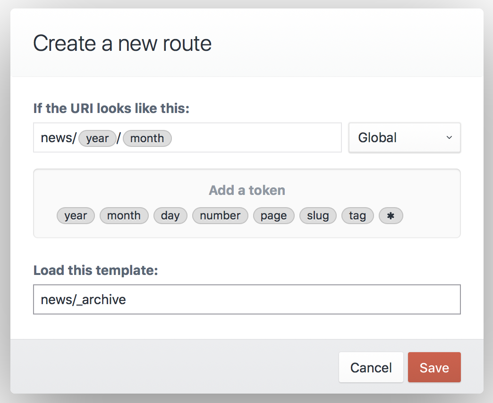

ルーティング
=======

ルーティングは、Craft がサイトのリクエストをスマートに処理するのに役立ちます。Craft にリクエストが届くと、リクエストの送り先を決定するためにチェックします。

以下に詳述されたチェック項目は、このプロセスの仕組みを説明しています。この情報は、テンプレートの読み込み、プラグインのアクション URL、動的なルート、および、予期しない 404 エラーのトラブルシューティングに役立ちます。

Craft はリクエストを次のように処理します。

0. **このリクエストを Craft が最初に処理するべきか？**

   サーバーに到達する*すべての*リクエストに Craft が実際に関係しているわけではなく、`index.php` ファイルへのリクエストだけであると念頭におくことが重要です。

   [Craft に付属する](https://craftcms.com/support/remove-index.php) `.htaccess` ファイルは、 404 になるであろうすべてのリクエストを内部で `index.php` にリダイレクトします。これによって、Craft はウェブルート内の有効なディレクトリやファイルを指し示さない URL に応答します。しかし、（画像 URL のような）*実際に*存在するファイルをブラウザが直接指し示す場合は、ウェブサーバーは、Craft の介入なしで、直接そのファイルを配信します。

1. **それはアクションリクエストか？**

   アクションリクエストは、`actions/`（または、コンフィグ設定の [actionTrigger](https://docs.craftcms.com/api/v3/craft-config-generalconfig.html#$actionTrigger-detail) にセットされたもの）ではじまる URL か、POST リクエストやクエリ文字列に `action` パラメータのいずれかを持っています。

   Craft は、アクションを実行するコントローラーアクションに、アクションリクエストをルーティングします。Craft にはコアアクションのためのシステムコントローラーアクションがありますが、プラグインが同様に独自のカスタムアクションを定義したコントローラーを持っている場合があります。

   リクエストが、コントローラーの呼び出し後に必ずしも終了するとは限りません。コントローラーがそれをキープし続けることを許可するかもしれません。

2. **エントリ／カテゴリのリクエストか？**

   URL が[エントリ](sections-and-entries.md)や[カテゴリ](categories.md)の URI にマッチする場合、Craft はセクションのテンプレートかカテゴリグループのテンプレートをロードします。Craft はあらかじめ用意された変数 `entry` や `category` を経由して、マッチしたエレメントをテンプレートで利用可能にします。

   （このステップは、エントリやカテゴリに制限されません。プラグインもまた、エレメントの種類を追加したり、専用の URL を持つように決めることができます。）

3. **URI が動的なルートとマッチするか？**

   URI がいずれかの[動的なルート](#dynamic-routes)にマッチする場合、そのルートで指定されたテンプレートが読み込まれます。ルートにトークンが含まれる場合、そのテンプレートの変数として利用可能です。

4. **URI がテンプレートとマッチするか？**

   最後に、Craft はその URI が有効な[テンプレートパス](templating-overview.md#template-paths)かどうかをチェックします。そうであれば、Craft はマッチしたテンプレートを返します。メモ：URL セグメントがアンダースコア（`_`）ではじまる場合、Craft は 404 を返します。Craft はアンダースコアではじまるテンプレートパスのセグメントに直接アクセスすることから隠します。

5. **404**

   上記のチェックがいずれも成功しなかった場合、Craf は 404 を返します。`craft/templates/` ディレクトリのルートにある `404.html` テンプレートで、サイトの 404 ページをカスタマイズできます。

## 動的なルート

テンプレートを読み込むための URL が必要なものの、URI とテンプレートパスをマッチさせたくない場合があります。

年を URL のセグメントの1つ（例：`news/archive/2017`）にする年別アーカイブページが、よい例です。毎年新しいテンプレートを作成するのは、賢明とは言えません。代わりに、新しい動的なルートをセットアップしましょう。



### ルートの作成

新しいルートを作成するには、「設定 > ルート」に移動し、「新規ルート」ボタンをクリックします。ルートの設定を定義できるモーダルウィンドウが表示されます。

モーダルの設定は、次の通りです。

* URI がどのように見えるか？
* どのテンプレートを読み込むか？

最初の設定には、特定の文字列ではなく、マッチ可能な範囲を意味する「トークン」を含めることができます。（例えば、“year” トークンは4桁の連続する数字を表します。） トークンをクリックすると、Craft は URI 設定欄のカーソル位置にそれを挿入します。

`news/archive/2017` のような URI とマッチさせる場合は、URI フィールドに `news/archive/` と入力し、“year” トークンをクリックします。

メモ：URI はスラッシュ（/）ではじめるべき**ではありません**。 

UIRI パターンを定義しテンプレートパスを入力したら、「保存」ボタンをクリックします。モーダルが閉じ、ページに新しいルートが表示されるでしょう。

ブラウザが `http://example.com/news/archive/2017` を指し示すとき、新しいルートがマッチし、Craft は指定されたテンプレートを読み込みます。

"year" トークンの値は、`year` と呼ばれる変数としてテンプレートで利用可能です。

### 利用可能なトークン

URI 設定では、次のトークンが利用可能です。

* * – スラッシュ（/）を除く、任意の文字列
* **day** – 月の特定の日（1-31 または 01-31）
* **month** – 月の数値表現（1-12 または 01-12）
* **number** – 任意の正の整数
* **page** – 任意の正の整数
* **slug** – スラッシュ（/）を除く、任意の文字列
* **tag** – スラッシュ（/）を除く、任意の文字列
* **year** – 4桁の連続する数字

## 高度なルーティング

コントローラーアクションへのルートをセットアップする必要がある場合や、「設定 > ルート」で利用可能なトークンがカバーされていない URI パターンにマッチさせるテンプレートルートを作成する必要がある場合は、`craft/config/routes.php` にルートを設定することもできます。

リクエストが届くと、Craft は初めにこのファイルをチェックし、次に「設定 > ルート」に定義されたルートをチェックします。

### 基本構文

`craft/config/routes.php` のルートは、一般的に次のような構文になります。

```php
// routes "news/subscribe" to a "lists/subscribe/news" action:
'news/subscribe' => 'lists/subscribe/news',

// routes "news/archive/2020" to a "news/_archive" template:
'news/archive/<year:\d{4}>' => ['template' => 'news/_archive'],
```

インストールした Craft に複数のサイトがある場合は、ルートにターゲットのロケールを指定することもできます。

```php
'news/archive/<year:\d{4}>' => 'news/_archive',

'de' => array(
 'nachrichten/archiv/<year:\d{4}>' => 'de/nachrichten/_archiv',
),
```

URL ルールとルートを定義するための完全な仕様は、[Yii documentation](https://www.yiiframework.com/doc/guide/2.0/en/runtime-routing#using-pretty-urls) を参照してください。Craft が独自に追加しているのは、テンプレートのルート（`['template' => 'some/template']`）のサポートだけです。

### テンプレート内のサブパターンへのアクセス

テンプレートのルートがサブパターンを含む場合、Craft はマッチしたテンプレートに `matches` 配列を渡します。例として、次のルートがあるとします。

```php
'news/(\d{4})/(\d{2})' => 'news/_archive',
```

`http://example.com/news/2020/10` にアクセスすると、`news/_archive.html` テンプレートは、変数 `matches` をセットした状態で読み込まれます。

```php
[
 0 => 'news/2020/10',
 1 => '2020',
 2 => '10'
]
```

名前付けされたサブパターンを指定する場合、マッチしたものも同様に独自の変数を取得します。例として、次のルートがあるとします。

```php
'news/<year:\d{4}>/<month:\d{2}>' => 'news/_archive',
```

`http://example.com/news/2020/10` にアクセスすると、`news/_archive.html` テンプレートは `year` と `month` 変数に `2017` と `04` をセットした状態で読み込まれます。

