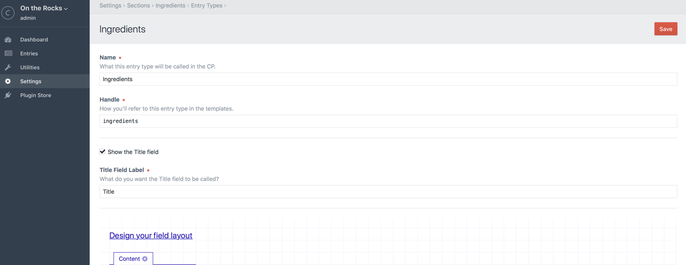

# セクションとエントリー

Introduction here

## エントリー

エントリーはウェブページに表示させたいコンテンツを保持します。すべてのエントリーは投稿者、投稿日、（もし望むなら）有効期限日、（有効・無効の）ステータスと、もちろん、コンテンツを持っています。

エントリーの現在の公開バージョンと並行して、エントリーのドラフトを作成することもできます。

一般的に、それぞれのエントリーはサイトの独自のプライマリー URL に関わり合いを持ちますが、Craft ではテンプレートが必要とするならば、どこからでもエントリーを取得できます。

## セクション

エントリーを作成する前に、それらを含むセクションを作成しなければなりません。それぞれのセクションには、次のことを定義できます。

* セクション内のエントリーが URL を持つかどうか
* エントリーの URL をどのように表示するか
* エントリーの URL がリクエストされたとき、どのテンプレートを読み込むか
* セクション内でどのようなエントリータイプが利用可能か、それらのエントリータイプはどのようなフィールドを持つ必要があるか

Craft のマルチサイト機能を利用しているなら、次のこともセクションで定義できます。

* セクション内のどのサイトのエントリーをターゲットにするか
* 新しいエントリー向けに、どのサイトをデフォルトで有効にするか

新しいセクションを作るには、「設定 > セクション」に移動し、「新規セクション」ボタンをクリックします。

### セクションタイプ

すべてのセクションが同じように作成されるわけではありません。Craft には3つの異なるタイプのセクションがあります。

#### シングル

シングルは、次のようなユニークなコンテンツを持つ1回限りのページで利用します。

* ホームページ
* 会社概要ページ
* お問い合わせページ

他のセクションタイプと異なり、シングルは1つのエントリーしか関連づけられておらず、編集可能な投稿者、スラグ、投稿日、または有効期限日がありません。

#### チャンネル

チャンネルは、次のような類似するコンテンツのストリームに利用します。

* ブログ
* ニュースのセクション
* レシピ

#### ストラクチャー

ストラクチャーは、複数の類似するエントリーを格納し、かつ、特定の順序で並び替える必要がある場合に適しています。それらは階層構造を持つこともできます。例として次のものを含みます。

* ドキュメント
* サービスの順序が重要なサービスのセクション
* 会社の組織図

### エントリー URI 形式

チャンネルとストラクチャーセクションでは、「エントリー URI 形式」設定を入力することでシステム内のエントリーに URL を割り当てるかどうかを選択できます。

エントリー URL 形式は、セクション内のエントリーが保存されるごとにレンダリングされる小さな Twig テンプレートです。 レンダリング結果は、システムのエントリー URI として保存されます。

保存されているエントリーは、`object` 変数としてテンプレートで利用できます。さらに、各エントリーのプロパティやカスタムフィールドの値は、それぞれの変数として利用できます。そのため、次のようなことが可能です。

```twig
{{ author.username }}/{{ slug }}
```

ショートカット構文は、エントリーのプロパティを参照する出力タグでも利用できます。

```twig
{author.username}/{slug}
```

ストラクチャーセクションでは、エントリーがトップレベルかネストされているかによって、異なるエントリー URI 形式を持つことを望むかもしれません。

```twig
docs{parent.uri}{slug}
```

このエントリー URI 形式では、トップレベルエントリーは URI `docs/templating` で終わるかもしれないのに対して、ネスとされているエントリーの URI `docs/templating/tags` で終わるかもしれません。

同じテンプレートは次の構文で表すこともできます。

```twig
{parent.uri ?? 'docs'}/{slug}
```

## 入力タイプ

チャンネルとストラクチャーセクションの両方では、入力タイプを用いて複数のタイプのエントリーを定義できます。

「設定 >  セクション」のセクション名の横にある「入力タイプを変更してください。」リンクをクリックして、セクションの入力タイプを管理できます。セクションの入力タイプのインデックスに移動します。いずれかの入力タイプの名前をクリックすると、その設定ページへ移動します。



入力タイプの設定は、次の通りです。

* **名前** – 入力タイプの名前
* **ハンドル** – 入力タイプのテンプレートに対応するハンドル
* **タイトルのフィールドの見る** – この入力タイプのエントリーでタイトルフィールドを表示するかどうか
* **タイトルフィールドラベル** – 「タイトル」フィールドのラベルをどうするか

### 動的なエントリータイトル

投稿者に入力を求めるのではなく、自動生成されたタイトルにする場合は、「タイトルのフィールドを見る。」チェックボックスをオフにします。その際、新たに「タイトル形式」欄が表示され、自動生成されるタイトルの見え方を定義できます。

タイトル形式は本格的な Twig テンプレートで、エントリーが保存されるたびに解析されます。

エントリーは `object` という名称の変数としてこのテンプレートに渡されます。エントリーの [プロパティ](https://docs.craftcms.com/api/v3/craft-elements-entry.html#public-properties) は、次の2つの方法で参照できます。

* `{{ object.property }}` _（標準の Twig 構文）_
* `{property}` _（ショートカット構文）_

_ショートカット構文には、中括弧が1つしかないことに注意してください_。

Craft がタイトル形式の中でショートカット構文を見つけた場合、Twig の解析にあたりテンプレートへ渡す前に `{` を `{{object.` 、`}` を `}}` に置換します。

いずれの構文でも Twig フィルタを使えます。

```twig
{{ object.postDate|date('M j, Y') }}
{postDate|date('M j, Y')}
```

Craft の [グローバル変数](templating/global-variables.md) は、これらのテンプレートでも利用できます。

```twig
{{ now|date('Y-m-d') }}
{{ currentUser.username }}
```

条件文もまた、かっこうの標的です。ショートカット構文がないため、エントリープロパティの1つで条件分岐する場合は、変数 `object` で参照する必要があります。

```twig
{postDate|date('M j, Y')}{{ now|date('M j, Y') }}
```

## エントリーの編集

少なくとも1つのセクションがあれば、CP のメインナビゲーションに「エントリー」タブが表示されます。クリックすると、エントリーのインデックスに移動します。そこから、編集したいエントリーに移動したり、新しいエントリーを作成できます。

エントリーの編集ページでは、次のアクションを実行できます。

* （選択候補が2つ以上ある場合）入力タイプの選択
* エントリーのタイトルの編集
* エントリーのスラグの編集
* エントリーのカスタムフィールドコンテンツの編集
* エントリーの投稿者の選択（ユーザーが必要）
* （ストラクチャーセクションに含まれる場合）エントリーの親の選択
* エントリーの投稿日の選択
* エントリーの有効期限の選択（オプション）
* エントリーを有効にするかどうかの選択
* エントリーの変更を保存
* エントリーの新しいドラフトの保存（Craft Client または Craft Pro が必要）
* ドラフトの公開（Craft Client または Craft Pro が必要）
* エントリーの過去のバージョンの閲覧（Craft Client または Craft Pro が必要）

投稿日を空のままにした場合、Craft はエントリーが有効な状態で保存された最初のタイミングで自動的にセットします。

