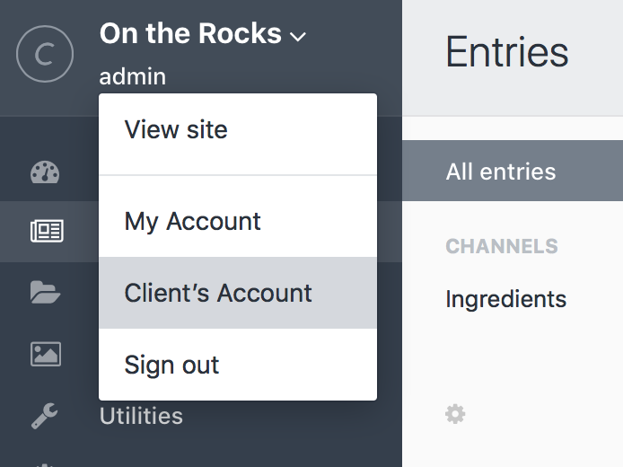

ユーザー
=====

Craft はシステムのすべてのメンバーアカウントを「ユーザー」と呼びます。

Craft は[インストール](installation.md)中に最初のユーザーアカウントを作成します。Craft Personal を使い続けるなら、あなたが作成可能な唯一のアカウントとなります。さらに必要であれば、追加のユーザーアカウントを提供する Craft Client か Craft Pro のどちらかに[アップグレード](/pricing) する必要があります。

## 管理者アカウント

管理者アカウントは、明示的な権限がない次のことを含め、 Craft 内のすべての操作を確実に行うことができる特別なアカウントです。

* 設定セクションに含まれるすべてのこと
* 他のユーザーを管理者にする（Craft Pro のみ）
* 他の管理者を管理する（Craft Pro のみ）

インストール中に作成したユーザーアカウントが、デフォルトで管理者になります。

> 管理者が行うことができるダメージの量を考えると、新しい管理者アカウントの作成は慎重に行うことを強くお勧めします。彼（彼女）らが自分が実行することの意味を理解できていると確信できる場合のみに留めてください。

## Client’s Account

Craft Client allows you to add one additional user account to the system: the “Client’s Account”. You can create the Client’s Account via the Account menu in the bottom left of the Control Panel.

The first time you click that option, you need to complete the registration page where you can create the Client’s Account. Once you create a Client Account, you will see an account settings page if you visit the "Client's Account" page again.

The Client’s Account is _not_ an Admin account like yours, so they will not be able to access the Settings section or administrate your Admin account. They’ll be able to do everything else, though.

If you ever upgrade from Craft Client to Craft Pro, note that the Client’s Account will become just like any other user account. You will need to manually assign any permissions you want that account to have at that point.

## ユーザーグループ

Craft Pro を使っている場合、サイトのユーザーアカウントを整理したり、権限を一括設定するためにユーザーグループを作成することができます。

新しいユーザーグループを作るには、「設定 > ユーザー」に移動し、「新しいユーザーグループ」ボタンをクリックします。グループには、名前とハンドルに加え、グループに含まれるすべてのユーザーに与える権限をセットすることができます。

グループの作成後は、アカウント設定の「権利」タブをクリックして、ユーザーをグループに割り当てることができます。

## 権限

Craft Pro では、コントロールパネルにアクセスしたり、特定セクションのコンテンツを編集するといった権限をユーザーやグループに許可できます。これらの権限はユーザーアカウントと同様にユーザーグループにも直接適用できます。ユーザーグループに権限を適用すると、そのグループに所属するすべてのユーザーがそれを継承します。

Craft の権限は次の通りです。

| 権限 | ハンドル |
| ---------- | ------ |
| システムがオフの場合にサイトにアクセスする | `accessSiteWhenSystemIsOff` |
| 管理画面にアクセスする | `accessCp` |
| ↳  システムがオフの場合に管理画面にアクセスする | `accessCpWhenSystemIsOff` |
| ↳  Craft CMS起動とプラグインのアップデート | `performUpdates` |
| ↳  _「プラグイン名」_のアクセス  | `accessPlugin-[PluginHandle]` |
| ユーザーを編集する | `editUsers` |
| ↳  ユーザーを登録する | `registerUsers` |
| ↳  ユーザー権限を割り当てる | `assignUserPermissions` |
| ↳  ユーザーを管理 | `administrateUsers` |
| ユーザーを削除する | `deleteUsers` |
| _「サイト名」_を編集する | `editLocale:[LocaleID]` |
| エントリを編集する | `editEntries:[SectionID]` |
| ↳  エントリを作る | `createEntries:[SectionID]` |
| ↳  ライブの変更を発表する | `publishEntries:[SectionID]` |
| ↳  エントリを削除する | `deleteEntries:[SectionID]` |
| ↳  他の投稿者のエントリを編集する | `editPeerEntries:[SectionID]` |
|       ↳  他の作成者の入力のためライブを変更する。 | `publishPeerEntries:[SectionID]` |
|       ↳  他の投稿者のエントリを削除する。 | `deletePeerEntries:[SectionID]` |
| ↳  他の投稿者の下書きを編集する | `editPeerEntryDrafts:[SectionID]` |
|       ↳  他の投稿者の下書きを投稿する | `publishPeerEntryDrafts:[SectionID]` |
|       ↳  他の投稿者の下書きを削除する | `deletePeerEntryDrafts:[SectionID]` |
| _「グローバル設定名」_を編集する | `editGlobalSet:[GlobalSetID]` |
| _「カテゴリグループ名」_を編集する | `editCategories:[CategoryGroupID]` |
| _「アセットソース名」_を表示する | `viewAssetSource:[SourceID]` |
| ↳  アップロード | `uploadToAssetSource:[SourceID]` |
| ↳  サブフォルダを作成する | `createSubfoldersInAssetSource:[SourceID]` |
| ↳  ファイルとフォルダーを削除 | `removeFromAssetSource:[SourceID]` |

## 公開登録

Craft Pro には、一般ユーザーの登録を許可するオプションがあり、デフォルトで無効化されています。

公開登録を有効にするには、「設定 > ユーザー > 設定」に移動し、「公的登録を許可しますか？」をチェックします。チェックすると、Craft が公開登録したユーザーを割り当てるデフォルトのユーザーグループを選択できるようになります。

サイトに一般ユーザーの登録を許可する設定を行ったら、最後のステップとしてフロントエンドに[ユーザー登録フォーム](templating/examples/user-registration-form.md)を作成します。

